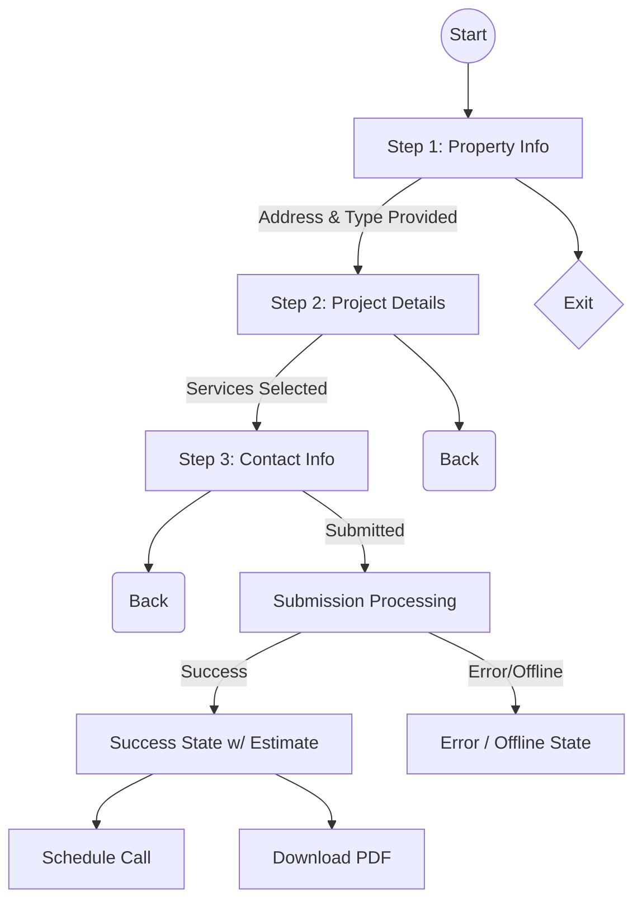

# User Flows

## Instant Estimate Form

  * [cite\_start]**User Goal:** To get a quick, reasonably accurate price range for their exterior project. [cite: 686]
  * [cite\_start]**Entry Points:** "Get Instant Estimate" CTA in the hero section and sticky mobile CTA bar. [cite: 686]
  * [cite\_start]**Success Criteria:** User successfully submits the form and sees the Success State with their estimate range and scheduling options. [cite: 686]
  * **Flow Diagram:**

